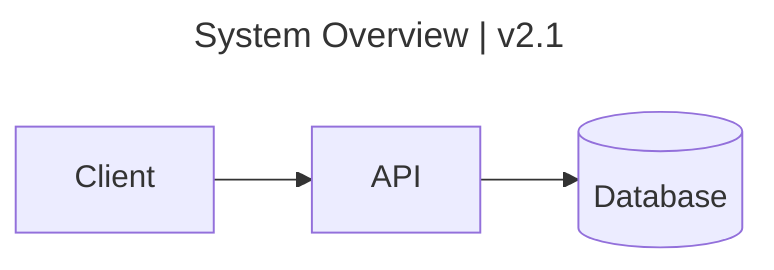

# Converting Markdown to HTML with `mdtohtml`

`mdtohtml` converts one or more extended Markdown files into styled,
**single-file, self-contained** HTML — no server, no network call, and no
separate CSS or asset files. Everything (theme CSS, math markup, diagram SVG,
embedded images) is inlined into each output file. Math and diagrams are
pre-rendered at convert time, so they carry no client-side script; the only
JavaScript that can appear is a small **inline** scrollspy that highlights the
active section in the `--toc` sidebar. Without `--toc` the output runs zero
JavaScript.

Assume the `mdtohtml` command is already on `PATH`. Installing it is out of
scope for this skill. If the command is missing, say so and stop — do not try
to install it or fall back to another converter. Run `mdtohtml --help` to
confirm the flags on the installed version, and `mdtohtml --version` for its
version.

## Invocation and output modes

Inputs must be `.md` files. There are exactly three output modes, chosen by the
`-o`/`--output` flag:

```bash
# 1. stdout  — no -o. Single input only.
mdtohtml notes.md > notes.html

# 2. file    — -o path ending in .html. Single input only.
mdtohtml notes.md -o notes.html

# 3. directory — -o path NOT ending in .html (created if needed).
#    One {stem}.html per input; the only mode that accepts many inputs.
mdtohtml intro.md guide.md api.md -o out/
mdtohtml *.md -o docs_html/
```

Rules the tool enforces (each is a hard error, exit 1):

- A non-existent path or any input whose suffix is not `.md`.
- Multiple inputs with no `-o` (stdout takes one file) or with an `.html` file
  `-o` (many inputs need a directory).
- Output is always HTML.

In directory mode a single unconvertible file is warned about and skipped so
the rest still convert; the run then exits non-zero. In stdout and single-file
modes any failure aborts with a message.

## Flags

| Flag | Effect |
|------|--------|
| `-o`, `--output PATH` | Output file (a `.html` path) or directory (any other path). Omit for stdout. |
| `--theme NAME` | Theme to inline. One of `default`, `dark`, `print`, `report` (plus any extra `.css` in the themes folder). Default: `default`. |
| `--toc` | Add a table-of-contents sidebar built from the document headings. |
| `--ignore "a,b"` | Comma-separated callout **types** to drop from the output, e.g. `--ignore "info,tip"`. |
| `--themes-dir DIR` | Use a themes folder kept elsewhere instead of the one beside the binary. |
| `--version` | Print the version and exit. |
| `-h`, `--help` | Print usage and exit. |

```bash
# Dark theme with a contents sidebar
mdtohtml notes.md --theme dark --toc -o notes.html

# A polished report, dropping note/tip callouts
mdtohtml brief.md --theme report --toc --ignore "note,tip" -o brief.html
```

## Themes

Four themes ship: **`default`** (light), **`dark`**, **`print`** (tuned for
paper), and **`report`**. `report` is a warm, AA-accessible visual system that
auto-switches light/dark with the reader's `prefers-color-scheme` and styles
headings, tables, callout cards, coloured chips, framed diagrams, and a
front-matter hero as a cohesive report — reach for it when the output should
look like a finished document rather than plain notes.

Themes are just CSS files in a `themes/` folder next to the binary. To add one,
drop `mytheme.css` there (or into a `--themes-dir` folder) and pass
`--theme mytheme` — no rebuild. Features styled only by the `report` theme
(chips, the hero) degrade to plain text/markup under the other themes.

## Supported Markdown

Standard Markdown plus extended syntax:

- **Callouts:** a blockquote whose first line is `[!type]` (optionally
  `[!type] Custom title`). `type` must be one of 15 recognised types — `note`,
  `abstract`, `info`, `todo`, `tip`, `success`, `question`, `warning`,
  `important`, `failure`, `danger`, `bug`, `example`, `quote`, `keypoint`. An
  **unrecognised type silently stays a plain blockquote** (no error), so don't
  invent one. Use one level only; **nested** (`> > [!x]`) and lazy unindented
  continuation lines are not converted.
- **Wikilinks:** `[[Page]]` resolves to the `.html` sibling of that page;
  `[[Page|label]]` sets the link text.
- **Tables, footnotes, task lists** (`- [ ]` / `- [x]`), fenced **code blocks
  with syntax highlighting** (and `hl_lines` line emphasis), `~~strikethrough~~`,
  and `==highlight==`.
- **Table of contents:** enabled with `--toc` (a sidebar built from the
  headings, **`h1`–`h3` only** — deeper headings never appear), not inline
  syntax.
- **Typographic dashes:** `--` becomes an en-dash and `---` an em-dash; quotes
  and ellipses are left exactly as typed.

### Coloured chips — `:key[label]`

Inline `:key[label]` renders a categorical pill, where `key` is one of the 11
palette colours: `blue`, `green`, `amber`, `purple`, `teal`, `pink`, `lime`,
`gold`, `slate`, `red`, `gray`.

```markdown
Status :green[passing] · :red[blocked] · :slate[deferred]
```

A colon that is not one of these keys, or one glued to a preceding word
(`code:red[1]`), is left as ordinary text. Chips are styled by the `report`
theme; under other themes the label shows as plain text.

The curly-brace variant `:key{label}` (same 11 keys, same leading-token guard)
renders the label as **bold coloured text with no pill** — use it for coloured
inline emphasis rather than a category tag.

### Math — `$…$` and `$$…$$`

LaTeX math in `$inline$` and `$$display$$` delimiters is typeset to static
KaTeX markup **at convert time**; the output carries only the KaTeX stylesheet
(fonts inlined), and only when the document actually contains math — no engine
or client-side script ships. A malformed expression renders as a visible KaTeX
error instead of aborting the conversion.

### Diagrams — ` ```mermaid ` fences

A fenced code block tagged `mermaid` is pre-rendered to inline SVG at convert
time, so diagrams need no runtime JavaScript and no network call. A diagram
that fails to parse degrades to its source shown as a code block with a note,
so one bad diagram never breaks the document. Diagrams use the `dark` mermaid
palette under the `dark` theme and the default palette otherwise. A `title:` in
the mermaid front matter becomes a styled header bar on the `report` theme's
diagram card; a `left | right` title splits into a label and a right-aligned
meta note.

````markdown

````

### Self-contained images

An image whose source is a `data:` URI is preserved and ships inside the HTML —
no separate asset, no network fetch. For safety a `data:` URI is accepted
**only** as an image source and **only** for `image/*` MIME types; every other
`data:` payload is stripped by the sanitiser. Remote/relative image URLs are
left as-is but break self-containment.

## Report-theme structural markup

These extra markers render as plain text or ordinary markup under other themes,
but become styled elements under the `report` theme:

- **Section kicker** — a line `^ Label` immediately above a heading becomes a
  small mono-uppercase label over it. It also becomes **that heading's label in
  the `--toc` sidebar** (the sidebar falls back to the heading's own text when
  there is no kicker), so kickers change TOC output. Keep it a short plain
  label.
- **Caption** — a line `~ text` becomes a small faint caption; place it right
  under a diagram, image, or code block. Plain text only (no inline markdown).
- **Footer** — a `::: footer` line opens a footer region that runs until a line
  containing just `:::`; its inner Markdown (emphasis, links, lists) is
  rendered normally.

  ```markdown
  ::: footer
  Traced from **converter.py**.
  :::
  ```
- **Keyed table** — a line containing only `{.keyed}` immediately above a table
  marks that table for an accent key column. A `{.keyed}` with no table right
  after it stays literal text.
- **Code-block title bar** — a fenced block written
  ` ```{.python title="Before the fix | MainWnd.cs"} ` highlights normally and
  gets a card header bar; the title splits on the first `|` into a left label
  and a right-aligned meta note (same split as a diagram title).

## Front matter and the report hero

A document may open with a `---` fenced block that supplies the `report`
theme's hero (the header band above the content). It is a tiny flat format, not
YAML; unrecognised keys are ignored, and all values are escaped/sanitised.

```markdown
---
eyebrow: mdtohtml · component reference
title: A Field Guide to mdtohtml
lede: A one-paragraph intro that may contain **inline markdown**.
slot: Shipped | Server-side rendering | Zero runtime JavaScript.
slot: Themed | Report theme | Auto light/dark, AA-safe.
slot: Portable | Single file | Everything inlines into one HTML file.
---

## First section
```

- `title` sets both the hero `<h1>` and the document `<title>`. When a document
  uses front matter, its body should start at `##` (the hero supplies the `#`).
- `eyebrow` is a small mono kicker above the title; `lede` is the oversized
  intro line (accepts inline markdown).
- Each `slot:` line is one card, split on `|` into `label | heading | body`
  (three cards read best; they stack on narrow screens). `heading` and `body`
  accept inline markdown; `label` is a plain mono kicker.

The hero is styled only by the `report` theme; other themes leave it (and
chips) unstyled.
